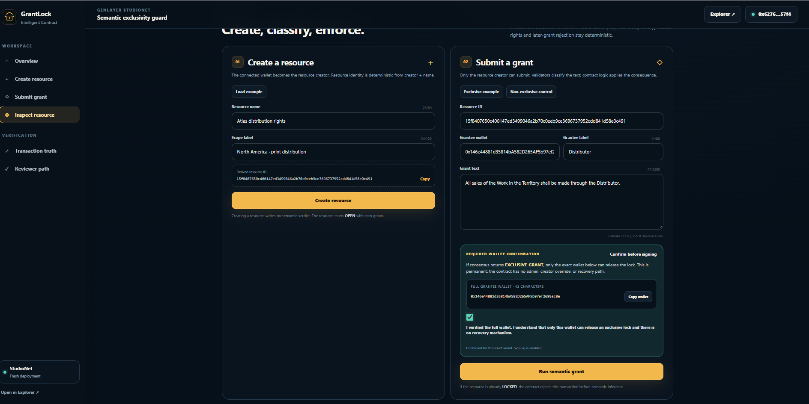
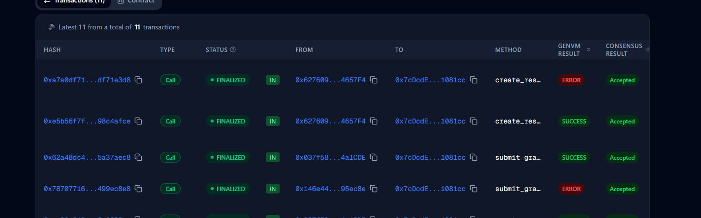
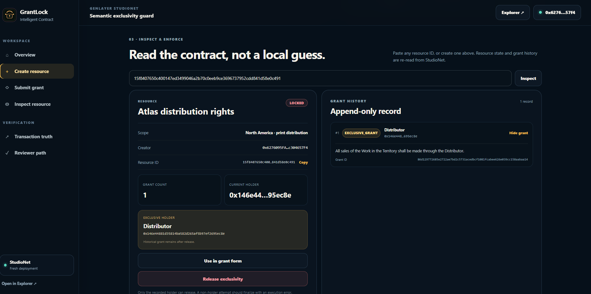

# GrantLock final-deployment evidence

Captured on 2026-09-25 from the production frontend and the GenLayer StudioNet Explorer.

## Deployment identity

- Production: <https://grant-lock.vercel.app/>
- Contract: `0x7cDcdE83B2a5192ACC00412cf192684c951081cc`
- Explorer: <https://explorer-studio.genlayer.com/address/0x7cDcdE83B2a5192ACC00412cf192684c951081cc>
- Resource ID: `15f8407650c400147ed3499046a2b70c0eeb9ce3696737952cdd841d58e0c491`
- Creator: `0x6276095FAEA15108740445ff277fdA8c304657F4`
- Recorded holder: `0x146e44881d35814bA582D265AF5b97ef2695ec8e`

## Captured evidence

### 1. Irreversible-wallet confirmation

[`grantee-wallet-confirmation.png`](./grantee-wallet-confirmation.png) shows the production UI displaying the complete 42-character grantee wallet, the permanent-holder/no-recovery warning, the explicit acknowledgement, and the enabled semantic-grant action.

### 2. Explorer execution/finality view

[`transaction-runtime-finalized.png`](./transaction-runtime-finalized.png) shows finalized calls on the final contract. Successful `create_resource` and `submit_grant` rows have `GenVM SUCCESS` and consensus `Accepted`. Rejected duplicate/unauthorized attempts remain visible as execution-error rows.

The screenshot contains abbreviated transaction hashes. It is runtime corroboration, but this repository does not promote abbreviated hashes to exact-hash `PASS` entries in `TESTING.md`.

### 3. Authoritative accepted-state reread

[`final-locked-exclusive-grant.png`](./final-locked-exclusive-grant.png) shows the production frontend rereading StudioNet state for the resource above:

- resource state: `LOCKED`;
- grant count: `1`;
- verdict: `EXCLUSIVE_GRANT`;
- current holder: `0x146e44881d35814bA582D265AF5b97ef2695ec8e`;
- label: `Distributor`;
- grant text: `All sales of the Work in the Territory shall be made through the Distributor.`;
- append-only grant history: one visible record.

## Evidence boundaries

These images prove the captured production flow and accepted-state reread. They do not replace exact transaction URLs for test rows whose policy requires a full immutable hash. No seed phrase, private key, wallet-extension popup, or unrelated account data is included.
